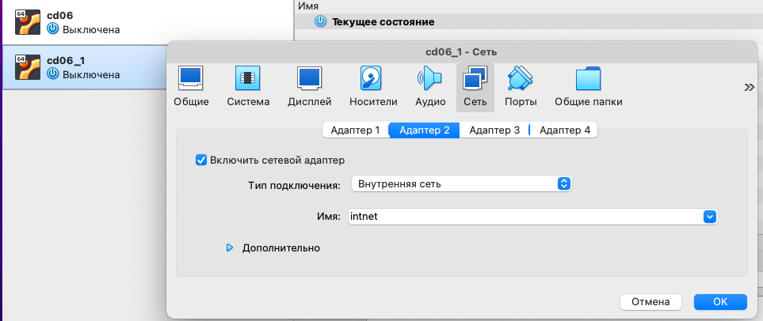

# CICD Project
## Подключение по ssh
https://www.makeuseof.com/how-to-ssh-into-virtualbox-ubuntu/

ssh -p 2222 user@localhost

ls /usr/local/bin  - здесь должны лежать исполняемые файлы

## Part 1. Настройка gitlab-runner

### Установка gitlab-runner

https://docs.gitlab.com/runner/install/linux-repository.html

Добавить официальный репозиторий гитлаб

curl -L "https://packages.gitlab.com/install/repositories/runner/gitlab-runner/script.deb.sh" | sudo bash

Установили последнюю версию гитлаб раннер

sudo apt-get install gitlab-runner

Зарегистрировали раннер

sudo useradd --comment 'GitLab Runner' --create-home gitlab-runner --shell /bin/bash

sudo gitlab-runner install --user=gitlab-runner --working-directory=/home/gitlab-runner

sudo gitlab-runner start
Разрешаем автозапуск сервиса и стартуем его

sudo systemctl enable --now gitlab-runner


Регистрация gitlab-runner

Для корректной работы Runner его нужно связать с нашим проектом в GitLab

sudo gitlab-runner register

Адрес сервера

URL: https://repos.21-school.ru

токен для регистрации раннера

token: tNnFfcQPDohMsdLa2ZyH

с помощьью тегов можно указывать, на каких раннерах должны выполняться какие задачи

tags: 

исполнитель

executor: shell


sudo gitlab-runner verify
sudo gitlab-runner run


###Проверить статус gitlab-runner with

service gitlab-runner status


Команда sudo gitlab-runner list - проверяет какие раннеры есть

- Установка gcc

sudo apt install gcc -y

- Установка check

sudo apt update
sudo apt install check

- Установка make

sudo apt install make

Проверить, что в системе есть каталог make:

ls /usr/bin/make

Версия make:

make -version

## Part 2. Build test

```
cat > .gitlab-ci.yml

stage_build:
  stage: build
  script:
    - make -C src/cat s21_cat
    - make -C src/grep s21_grep
  artifacts:
    paths:
      - src/cat/s21_cat
      - src/grep/s21_grep
    expire_in: 30 days
```

## Part 3. Style test

.gitlab-ci.yml:
```
stage_codestyle:
  stage: codestyle
  script:
    - cp materials/linters/.clang-format src/
    - cd src
    - clang-format -n cat/s21_cat.* 2>> output.txt
    - clang-format -n grep/s21_grep.* 2>> output.txt
    - if [ -s output.txt ]; then (cat output.txt && rm output.txt && exit 1); fi
```

## Part 4. Testing code 

.gitlab-ci.yml:
```
stage_test:
  stage: test
  tags:
    - test
  script:
    - src/test.sh
  when: on_success
```

## Part 5. Deploying

Подняли вторую виртуальную машину.

Сетевые интерфейсы:

сеть - 127.0.0.1/8

user:
```
network:
  ethernets:
    enp0s3:
      dhcp4: true
    enp0s8:
      dhcp4: false
      addresses: [192.168.100.10/16]
  version: 2
~                                                                                                          
~                                                                                                          
~                                                                                                          
"/etc/netplan/00-installer-config.yaml
```

user1 :

```
network:
  ethernets:
    enp0s3:
      dhcp4: true
    enp0s8:
      dhcp4: false
      addresses: [172.24.116.8/12]
  version: 2
~                                                                                                          
~                                                                                                          
~                                                                                                          
"/etc/netplan/00-installer-config.yaml
```

Создать скрипт для копирования артефактов, полученных после сборки, с помощью ssh и scp в директорию /usr/local/bin второй виртуальной машины.

src/copy.sh:


```
Создали второй адаптер для внтутренней сети:



cat /etc/passwd - пользователи на виртуальной машине

- на второй машине разрешить подключение по ssh
- открыть конфиг ssh 


su - gitlab-runner  //   поменяли пароль раннера

установили sshd
открыть конфиг sshd на второй машине (разрешили логиниться как рут)
сделали пароль руту на второй машине sudo passwd root
с первой подключаемся к руту второй
проверили, что файл передается с одной машины на другую
установили sshpass

ssh root@10.0.2.5

От пользователя гитлаб подсоединились к руту на второй машине.
Проверка что работает scp

Копирование через scp с одной машины на другую

Заходили от рута на вторую машину


```

Check the rights on the 2nd machine folder for artifacts:

```
sudo chmod -R 777 /usr/local/bin/
```

.gitlab_ci.yml:

```
deploy:
  stage: deploy
  script:
    - bash src/copy.sh
  when: manual
```
Вход без пароля по ssh:


## Part 6. Notifications

###Create telegram bot using @BotFather

Change for every job in .gitlab-ci.yml:
```
  after_script:
    - sh src/notify.sh "job_name"
```